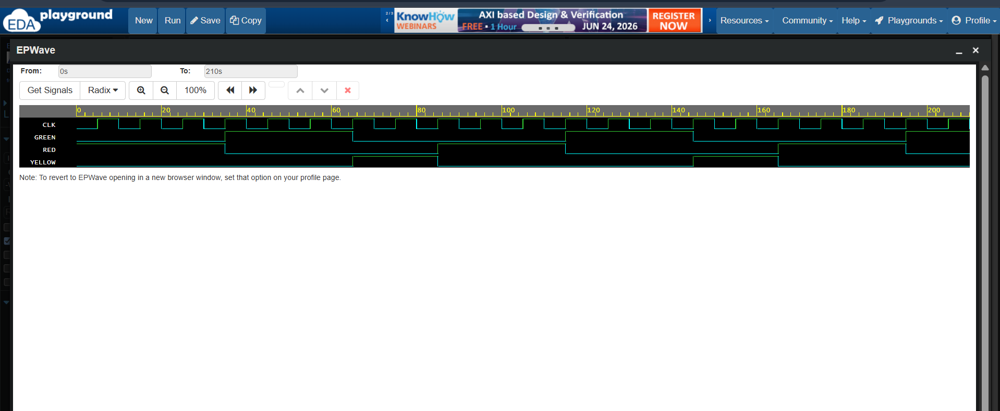

# 🚦 Traffic Light Controller using Verilog HDL

> 🌟 A Finite State Machine (FSM) based Traffic Light Controller designed and verified using **Verilog HDL**, **EDA Playground**, and **EPWave**.

---

## 📖 Overview

This project implements a simple **Traffic Light Controller** using a **Finite State Machine (FSM)** approach.

The controller automatically transitions between the three traffic signals:

🔴 **RED** → 🟢 **GREEN** → 🟡 **YELLOW** → 🔴 **RED**

An **Asynchronous RESET** signal is incorporated to ensure that the system always starts from the **RED state**, making the design more robust and industry-oriented.

---

## ✨ Features

✅ FSM-Based Design (Finite State Machine)

✅ Industry-Style Asynchronous RESET

✅ Automatic State Transitions

✅ Clock-Driven Operation

✅ Verilog HDL Implementation

✅ Functional Verification using EDA Playground

✅ Waveform Analysis using EPWave

---

## 🏗️ Repository Structure

```text
Traffic_Light_Controller/
│
├── traffic_light_controller.v
├── traffic_light_controller_tb.v
├── traffic_light_waveform.png
└── README.md
```

---

# 🔄 State Transition Diagram

```text
           ┌─────────┐
           │ 🔴 RED  │
           └────┬────┘
                │
                ▼
           ┌─────────┐
           │ 🟢 GREEN│
           └────┬────┘
                │
                ▼
           ┌─────────┐
           │ 🟡YELLOW│
           └────┬────┘
                │
                ▼
             🔴 RED
```

---

# 🚦 Traffic Light Sequence

| State | Active Light | Duration |
|---------|--------------|------------|
| RED | 🔴 RED | 3 Clock Cycles |
| GREEN | 🟢 GREEN | 3 Clock Cycles |
| YELLOW | 🟡 YELLOW | 2 Clock Cycles |

---

# 🧠 Working Principle

1️⃣ When the system is reset, the controller enters the **RED** state.

2️⃣ The RED light remains active for **3 clock cycles**.

3️⃣ The controller then transitions to the **GREEN** state for **3 clock cycles**.

4️⃣ After GREEN, the controller enters the **YELLOW** state for **2 clock cycles**.

5️⃣ The sequence repeats continuously:

```text
🔴 RED
   ↓
🟢 GREEN
   ↓
🟡 YELLOW
   ↓
🔴 RED
```

---

# 🔁 RESET Operation

The controller includes an **Asynchronous RESET** feature.

When:

```text
RESET = 1
```

the controller immediately initializes to:

```text
🔴 RED State
Counter = 0
```

This guarantees deterministic startup behavior, similar to real-world digital systems.

---

# 📷 Simulation Waveform

The waveform below verifies the correct FSM operation:

- RESET initializes the controller.
- RED remains active for 3 clock cycles.
- GREEN remains active for 3 clock cycles.
- YELLOW remains active for 2 clock cycles.
- The sequence repeats continuously.



---

# 🛠️ Tools Used

💻 Verilog HDL

🧪 EDA Playground

📈 EPWave

🌐 GitHub

---

# 🎯 Learning Outcomes

Through this project, I gained hands-on experience in:

🔹 Finite State Machine (FSM) Design

🔹 State Encoding and Transitions

🔹 Asynchronous RESET Implementation

🔹 Sequential Logic Design

🔹 Verilog HDL Coding

🔹 Testbench Development

🔹 Functional Verification

🔹 Waveform Analysis and Debugging

---

# 🚀 Future Enhancements

This project can be extended to include:

🚶 Pedestrian Crossing Button

🚑 Emergency Vehicle Priority

🚗 Four-Way Junction Controller

⏲️ Configurable Timing Parameters

🔀 Advanced Traffic Management FSMs

---

# 👩‍💻 Author

**Aneesa Pattan**

Electronics and Communication Engineering (ECE) Student

Aspiring VLSI & Digital Design Engineer 🚀

---

## ⭐ If you found this project interesting, consider starring the repository and connecting with me!

> *"From learning Verilog syntax to designing real-world FSMs, every project is a step closer to becoming a better digital design engineer."* 🌟
